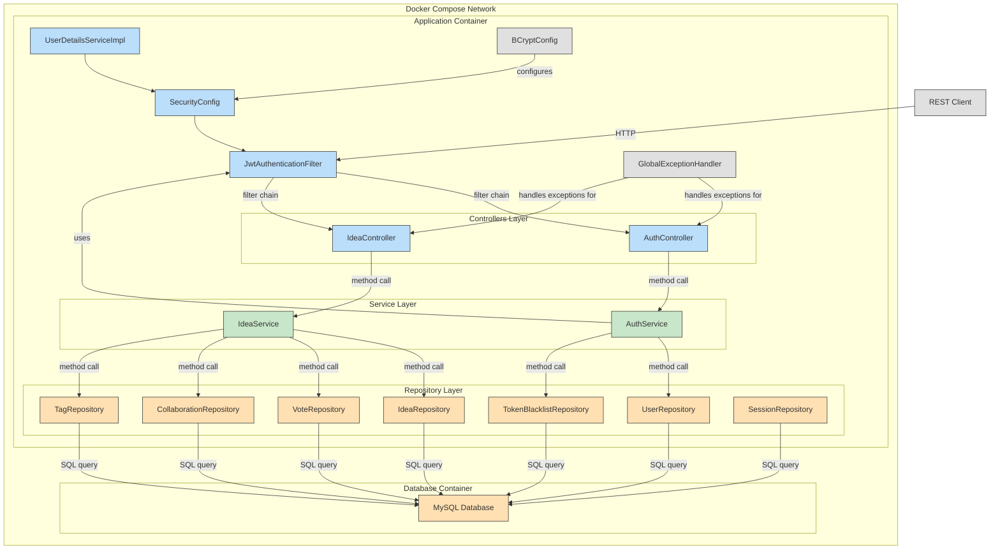
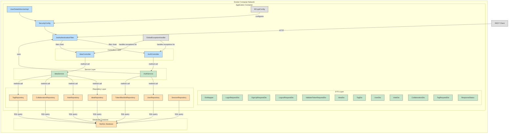

# Project Visualization And Control Flow

```mermaid
flowchart TB
    %% Docker Compose Network
    subgraph "Docker Compose Network"
        direction TB
        %% Application Container
        subgraph "Application Container"
            direction TB
            %% Security Filter Chain
            JwtFilter["JwtAuthenticationFilter"]:::api
            SecurityConfig["SecurityConfig"]:::api
            UserDetailsService["UserDetailsServiceImpl"]:::api

            %% Controllers Layer
            subgraph "Controllers Layer"
                direction TB
                AuthController["AuthController"]:::api
                IdeaController["IdeaController"]:::api
            end

            %% Service Layer
            subgraph "Service Layer"
                direction TB
                AuthService["AuthService"]:::service
                IdeaService["IdeaService"]:::service
            end

            %% Repository Layer
            subgraph "Repository Layer"
                direction TB
                UserRepo["UserRepository"]:::repo
                IdeaRepo["IdeaRepository"]:::repo
                VoteRepo["VoteRepository"]:::repo
                TagRepo["TagRepository"]:::repo
                CollaborationRepo["CollaborationRepository"]:::repo
                TokenBlacklistRepo["TokenBlacklistRepository"]:::repo
                SessionRepo["SessionRepository"]:::repo
            end

            %% Configuration & Exception
            BCryptConfig["BCryptConfig"]:::infra
            GlobalExceptionHandler["GlobalExceptionHandler"]:::infra
        end

        %% Database Container
        subgraph "Database Container"
            direction TB
            CollabDB["MySQL Database"]:::repo
        end
    end

    %% External Client
    Client["REST Client"]:::infra

    %% Connections
    Client -->|"HTTP"| JwtFilter
    JwtFilter -->|"filter chain"| AuthController
    JwtFilter -->|"filter chain"| IdeaController
    SecurityConfig --> JwtFilter
    UserDetailsService --> SecurityConfig

    AuthController -->|"method call"| AuthService
    IdeaController -->|"method call"| IdeaService

    AuthService -->|"method call"| UserRepo
    AuthService -->|"method call"| TokenBlacklistRepo
    AuthService -->|"uses"| JwtFilter
    IdeaService -->|"method call"| IdeaRepo
    IdeaService -->|"method call"| VoteRepo
    IdeaService -->|"method call"| CollaborationRepo
    IdeaService -->|"method call"| TagRepo

    UserRepo -->|"SQL query"| CollabDB
    IdeaRepo -->|"SQL query"| CollabDB
    VoteRepo -->|"SQL query"| CollabDB
    TagRepo -->|"SQL query"| CollabDB
    CollaborationRepo -->|"SQL query"| CollabDB
    TokenBlacklistRepo -->|"SQL query"| CollabDB
    SessionRepo -->|"SQL query"| CollabDB

    BCryptConfig -->|"configures"| SecurityConfig
    GlobalExceptionHandler -->|"handles exceptions for"| AuthController
    GlobalExceptionHandler -->|"handles exceptions for"| IdeaController

    %% Click Events
    click JwtFilter "https://github.com/manu05x/userauthidea/blob/main/src/main/java/com/ideacollab/security/JwtAuthenticationFilter.java"
    click SecurityConfig "https://github.com/manu05x/userauthidea/blob/main/src/main/java/com/ideacollab/security/SecurityConfig.java"
    click UserDetailsService "https://github.com/manu05x/userauthidea/blob/main/src/main/java/com/ideacollab/security/UserDetailsServiceImpl.java"
    click AuthController "https://github.com/manu05x/userauthidea/blob/main/src/main/java/com/ideacollab/controller/AuthController.java"
    click IdeaController "https://github.com/manu05x/userauthidea/blob/main/src/main/java/com/ideacollab/controller/IdeaController.java"
    click AuthService "https://github.com/manu05x/userauthidea/blob/main/src/main/java/com/ideacollab/service/AuthService.java"
    click IdeaService "https://github.com/manu05x/userauthidea/blob/main/src/main/java/com/ideacollab/service/IdeaService.java"
    click DtoMapper "https://github.com/manu05x/userauthidea/blob/main/src/main/java/com/ideacollab/dto/DtoMapper.java"
    click LoginRequestDto "https://github.com/manu05x/userauthidea/blob/main/src/main/java/com/ideacollab/dto/LoginRequestDto.java"
    click SignUpRequestDto "https://github.com/manu05x/userauthidea/blob/main/src/main/java/com/ideacollab/dto/SignUpRequestDto.java"
    click LogoutRequestDto "https://github.com/manu05x/userauthidea/blob/main/src/main/java/com/ideacollab/dto/LogoutRequestDto.java"
    click ValidateTokenRequestDto "https://github.com/manu05x/userauthidea/blob/main/src/main/java/com/ideacollab/dto/ValidateTokenRequestDto.java"
    click IdeaDto "https://github.com/manu05x/userauthidea/blob/main/src/main/java/com/ideacollab/dto/IdeaDto.java"
    click TagDto "https://github.com/manu05x/userauthidea/blob/main/src/main/java/com/ideacollab/dto/TagDto.java"
    click UserDto "https://github.com/manu05x/userauthidea/blob/main/src/main/java/com/ideacollab/dto/UserDto.java"
    click VoteDto "https://github.com/manu05x/userauthidea/blob/main/src/main/java/com/ideacollab/dto/VoteDto.java"
    click CollaborationDto "https://github.com/manu05x/userauthidea/blob/main/src/main/java/com/ideacollab/dto/CollaborationDto.java"
    click TagRequestDto "https://github.com/manu05x/userauthidea/blob/main/src/main/java/com/ideacollab/dto/TagRequestDto.java"
    click ResponseStatus "https://github.com/manu05x/userauthidea/blob/main/src/main/java/com/ideacollab/dto/ResponseStatus.java"
    click UserRepo "https://github.com/manu05x/userauthidea/blob/main/src/main/java/com/ideacollab/repository/UserRepository.java"
    click IdeaRepo "https://github.com/manu05x/userauthidea/blob/main/src/main/java/com/ideacollab/repository/IdeaRepository.java"
    click VoteRepo "https://github.com/manu05x/userauthidea/blob/main/src/main/java/com/ideacollab/repository/VoteRepository.java"
    click TagRepo "https://github.com/manu05x/userauthidea/blob/main/src/main/java/com/ideacollab/repository/TagRepository.java"
    click CollaborationRepo "https://github.com/manu05x/userauthidea/blob/main/src/main/java/com/ideacollab/repository/CollaborationRepository.java"
    click TokenBlacklistRepo "https://github.com/manu05x/userauthidea/blob/main/src/main/java/com/ideacollab/repository/TokenBlacklistRepository.java"
    click SessionRepo "https://github.com/manu05x/userauthidea/blob/main/src/main/java/com/ideacollab/repository/SessionRepository.java"
    click BCryptConfig "https://github.com/manu05x/userauthidea/blob/main/src/main/java/com/ideacollab/configurations/BCryptConfig.java"
    click GlobalExceptionHandler "https://github.com/manu05x/userauthidea/blob/main/src/main/java/com/ideacollab/exception/GlobalExceptionHandler.java"
    click CollabDB "https://github.com/manu05x/userauthidea/blob/main/docker-compose.yml"

    %% Styles
    classDef api fill:#BBDEFB,stroke:#333,stroke-width:1px
    classDef service fill:#C8E6C9,stroke:#333,stroke-width:1px
    classDef repo fill:#FFE0B2,stroke:#333,stroke-width:1px
    classDef infra fill:#E0E0E0,stroke:#333,stroke-width:1px
```

---

```mermaid
flowchart TB
    %% Docker Compose Network
    subgraph "Docker Compose Network"
        direction TB
        %% Application Container
        subgraph "Application Container"
            direction TB
            %% Security Filter Chain
            JwtFilter["JwtAuthenticationFilter"]:::api
            SecurityConfig["SecurityConfig"]:::api
            UserDetailsService["UserDetailsServiceImpl"]:::api

            %% Controllers Layer
            subgraph "Controllers Layer"
                direction TB
                AuthController["AuthController"]:::api
                IdeaController["IdeaController"]:::api
            end

            %% Service Layer
            subgraph "Service Layer"
                direction TB
                AuthService["AuthService"]:::service
                IdeaService["IdeaService"]:::service
            end

            %% DTO Layer
            subgraph "DTO Layer"
                direction TB
                DtoMapper["DtoMapper"]:::service
                LoginRequestDto["LoginRequestDto"]:::service
                SignUpRequestDto["SignUpRequestDto"]:::service
                LogoutRequestDto["LogoutRequestDto"]:::service
                ValidateTokenRequestDto["ValidateTokenRequestDto"]:::service
                IdeaDto["IdeaDto"]:::service
                TagDto["TagDto"]:::service
                UserDto["UserDto"]:::service
                VoteDto["VoteDto"]:::service
                CollaborationDto["CollaborationDto"]:::service
                TagRequestDto["TagRequestDto"]:::service
                ResponseStatus["ResponseStatus"]:::service
            end

            %% Repository Layer
            subgraph "Repository Layer"
                direction TB
                UserRepo["UserRepository"]:::repo
                IdeaRepo["IdeaRepository"]:::repo
                VoteRepo["VoteRepository"]:::repo
                TagRepo["TagRepository"]:::repo
                CollaborationRepo["CollaborationRepository"]:::repo
                TokenBlacklistRepo["TokenBlacklistRepository"]:::repo
                SessionRepo["SessionRepository"]:::repo
            end

            %% Configuration & Exception
            BCryptConfig["BCryptConfig"]:::infra
            GlobalExceptionHandler["GlobalExceptionHandler"]:::infra
        end

        %% Database Container
        subgraph "Database Container"
            direction TB
            CollabDB["MySQL Database"]:::repo
        end
    end

    %% External Client
    Client["REST Client"]:::infra

    %% Connections
    Client -->|"HTTP"| JwtFilter
    JwtFilter -->|"filter chain"| AuthController
    JwtFilter -->|"filter chain"| IdeaController
    SecurityConfig --> JwtFilter
    UserDetailsService --> SecurityConfig

    AuthController -->|"method call"| AuthService
    IdeaController -->|"method call"| IdeaService

    AuthService -->|"method call"| UserRepo
    AuthService -->|"method call"| TokenBlacklistRepo
    AuthService -->|"uses"| JwtFilter
    IdeaService -->|"method call"| IdeaRepo
    IdeaService -->|"method call"| VoteRepo
    IdeaService -->|"method call"| CollaborationRepo
    IdeaService -->|"method call"| TagRepo

    UserRepo -->|"SQL query"| CollabDB
    IdeaRepo -->|"SQL query"| CollabDB
    VoteRepo -->|"SQL query"| CollabDB
    TagRepo -->|"SQL query"| CollabDB
    CollaborationRepo -->|"SQL query"| CollabDB
    TokenBlacklistRepo -->|"SQL query"| CollabDB
    SessionRepo -->|"SQL query"| CollabDB

    BCryptConfig -->|"configures"| SecurityConfig
    GlobalExceptionHandler -->|"handles exceptions for"| AuthController
    GlobalExceptionHandler -->|"handles exceptions for"| IdeaController

    %% Click Events
    click JwtFilter "https://github.com/manu05x/userauthidea/blob/main/src/main/java/com/ideacollab/security/JwtAuthenticationFilter.java"
    click SecurityConfig "https://github.com/manu05x/userauthidea/blob/main/src/main/java/com/ideacollab/security/SecurityConfig.java"
    click UserDetailsService "https://github.com/manu05x/userauthidea/blob/main/src/main/java/com/ideacollab/security/UserDetailsServiceImpl.java"
    click AuthController "https://github.com/manu05x/userauthidea/blob/main/src/main/java/com/ideacollab/controller/AuthController.java"
    click IdeaController "https://github.com/manu05x/userauthidea/blob/main/src/main/java/com/ideacollab/controller/IdeaController.java"
    click AuthService "https://github.com/manu05x/userauthidea/blob/main/src/main/java/com/ideacollab/service/AuthService.java"
    click IdeaService "https://github.com/manu05x/userauthidea/blob/main/src/main/java/com/ideacollab/service/IdeaService.java"
    click DtoMapper "https://github.com/manu05x/userauthidea/blob/main/src/main/java/com/ideacollab/dto/DtoMapper.java"
    click LoginRequestDto "https://github.com/manu05x/userauthidea/blob/main/src/main/java/com/ideacollab/dto/LoginRequestDto.java"
    click SignUpRequestDto "https://github.com/manu05x/userauthidea/blob/main/src/main/java/com/ideacollab/dto/SignUpRequestDto.java"
    click LogoutRequestDto "https://github.com/manu05x/userauthidea/blob/main/src/main/java/com/ideacollab/dto/LogoutRequestDto.java"
    click ValidateTokenRequestDto "https://github.com/manu05x/userauthidea/blob/main/src/main/java/com/ideacollab/dto/ValidateTokenRequestDto.java"
    click IdeaDto "https://github.com/manu05x/userauthidea/blob/main/src/main/java/com/ideacollab/dto/IdeaDto.java"
    click TagDto "https://github.com/manu05x/userauthidea/blob/main/src/main/java/com/ideacollab/dto/TagDto.java"
    click UserDto "https://github.com/manu05x/userauthidea/blob/main/src/main/java/com/ideacollab/dto/UserDto.java"
    click VoteDto "https://github.com/manu05x/userauthidea/blob/main/src/main/java/com/ideacollab/dto/VoteDto.java"
    click CollaborationDto "https://github.com/manu05x/userauthidea/blob/main/src/main/java/com/ideacollab/dto/CollaborationDto.java"
    click TagRequestDto "https://github.com/manu05x/userauthidea/blob/main/src/main/java/com/ideacollab/dto/TagRequestDto.java"
    click ResponseStatus "https://github.com/manu05x/userauthidea/blob/main/src/main/java/com/ideacollab/dto/ResponseStatus.java"
    click UserRepo "https://github.com/manu05x/userauthidea/blob/main/src/main/java/com/ideacollab/repository/UserRepository.java"
    click IdeaRepo "https://github.com/manu05x/userauthidea/blob/main/src/main/java/com/ideacollab/repository/IdeaRepository.java"
    click VoteRepo "https://github.com/manu05x/userauthidea/blob/main/src/main/java/com/ideacollab/repository/VoteRepository.java"
    click TagRepo "https://github.com/manu05x/userauthidea/blob/main/src/main/java/com/ideacollab/repository/TagRepository.java"
    click CollaborationRepo "https://github.com/manu05x/userauthidea/blob/main/src/main/java/com/ideacollab/repository/CollaborationRepository.java"
    click TokenBlacklistRepo "https://github.com/manu05x/userauthidea/blob/main/src/main/java/com/ideacollab/repository/TokenBlacklistRepository.java"
    click SessionRepo "https://github.com/manu05x/userauthidea/blob/main/src/main/java/com/ideacollab/repository/SessionRepository.java"
    click BCryptConfig "https://github.com/manu05x/userauthidea/blob/main/src/main/java/com/ideacollab/configurations/BCryptConfig.java"
    click GlobalExceptionHandler "https://github.com/manu05x/userauthidea/blob/main/src/main/java/com/ideacollab/exception/GlobalExceptionHandler.java"
    click CollabDB "https://github.com/manu05x/userauthidea/blob/main/docker-compose.yml"

    %% Styles
    classDef api fill:#BBDEFB,stroke:#333,stroke-width:1px
    classDef service fill:#C8E6C9,stroke:#333,stroke-width:1px
    classDef repo fill:#FFE0B2,stroke:#333,stroke-width:1px
    classDef infra fill:#E0E0E0,stroke:#333,stroke-width:1px
```